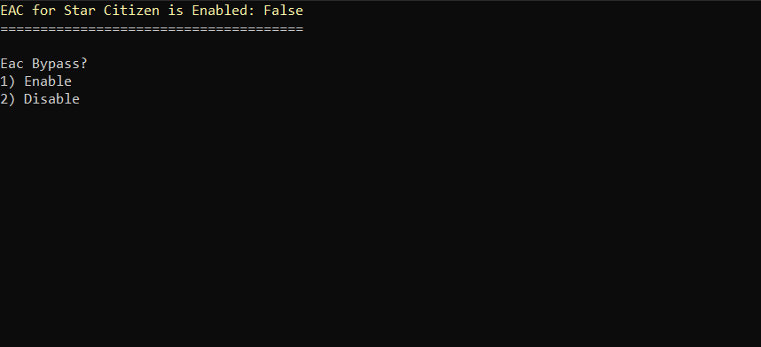
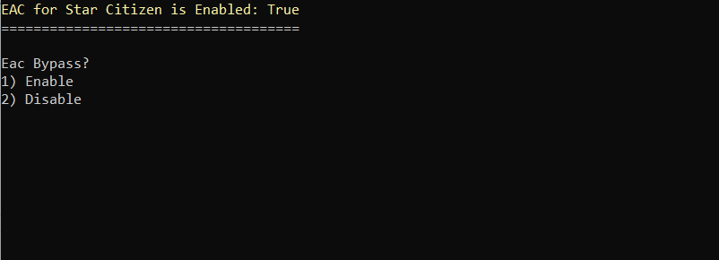

# Star Citizen Vorpx EAC Bypass Utility
---
A little utility to enable disable EAC for use with Vorpx and Star Citizen.
Thanks to Chachi Sanchez for figuring this out.
This is only the first half of getting this running.  Watch the video or join the discord channel [https://discord.gg/kJ9RHRuc6j](https://discord.gg/kJ9RHRuc6j) for written instructions.

 [Youtube Instructions](https://www.youtube.com/watch?v=lt4w73C6Wpo).

This utility will make backups of all files it modifies and allow you to uninstall as well.

**Note** you may need to run as adminstrator, or change the security settings on your hosts file to allow your account to write the file.

```C:\Windows\System32\drivers\etc\hosts```

 ## Installing
 Download and unzip somewhere and run it, and follow the prompts.  You may need the Net Core 7.0 Runtime dowload it [here](https://download.visualstudio.microsoft.com/download/pr/2ce1cbbe-71d1-44e7-8e80-d9ae336b9b17/a2706bca3474eef8ef95e10a12ecc2a4/windowsdesktop-runtime-7.0.11-win-x64.exe
 )




## Uninstalling


